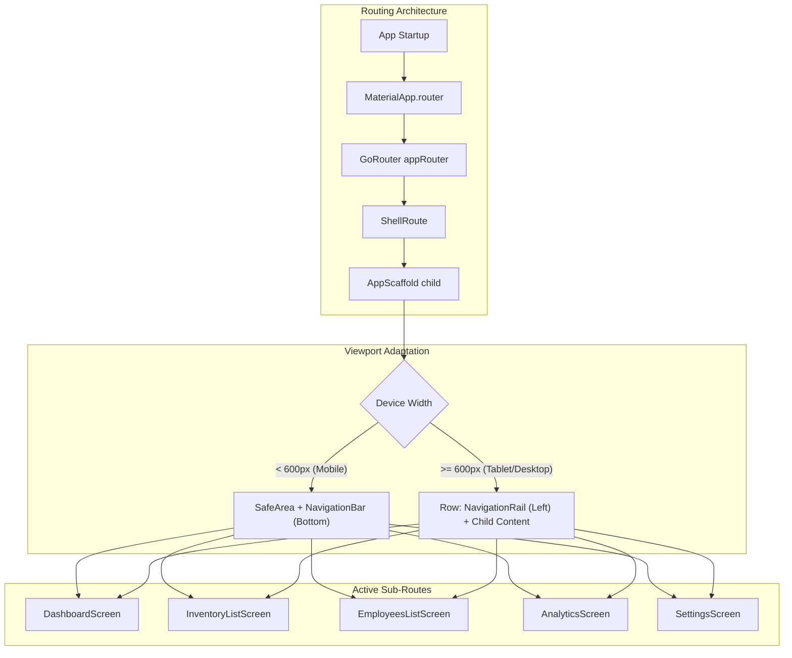

# nVentory Responsive Layout & Architecture Implementation Plan

This document details the step-by-step engineering plan to transform **nVentory** into a fully responsive, cross-platform app supporting Mobile, Tablet, and Desktop viewports.

---

## Architecture & Visual Overview

### 1. Navigation Routing Architecture (Before & After)

Below is the visual structure showing the wiring of [AppScaffold](file:///c:/Users/user/Downloads/flutterProjects/nventory/lib/routing/app_scaffold.dart) into [app_router.dart](file:///c:/Users/user/Downloads/flutterProjects/nventory/lib/routing/app_router.dart) using a `ShellRoute`.



### 2. Screen-Level Layout Scaling Strategies

Below is how screens transform across different viewports.

```mermaid
graph TD
    subgraph List Screens (Inventory & Employees)
        L_In[Widescreen Viewport] --> L_CC[ConstrainedContent max 1200px]
        L_CC --> L_GV[GridView.builder]
        L_GV -- "1 Column" --> L_Mob[Mobile ListTile]
        L_GV -- "2 Columns" --> L_Tab[Tablet Compact Card]
        L_GV -- "3 Columns" --> L_Desk[Desktop Expanded Card]
    end
    
    subgraph Detail Screens (Items & Employees)
        D_In[Widescreen Viewport] --> D_CC[ConstrainedContent max 900px]
        D_CC --> D_RB[ResponsiveBuilder]
        D_RB -- Mobile --> D_Col[Single-Column Scroll]
        D_RB -- Tablet --> D_RowT[60/40 Split Row]
        D_RB -- Desktop --> D_RowD[50/50 Split Row]
    end

    subgraph Form Screens (Item & Employee Forms)
        F_In[Widescreen Viewport] --> F_CC[ConstrainedContent max 800px]
        F_CC --> F_RB[Responsive Row Layouts]
        F_RB -- Mobile --> F_Vert[Stacked Inputs]
        F_RB -- "Tablet/Desktop" --> F_Side[Side-by-side grouped fields]
    end
```

---

## User Review Required

> [!IMPORTANT]
> **State Management vs deep linking sync**:
> We will replace the manual state setting in `navigationIndexProvider` with a computed/derived state from `GoRouterState.of(context).matchedLocation`. This prevents navigation bar indices from getting out of sync during back/forward actions, deep links, or programmatically triggered navigation.

> [!WARNING]
> **Package Removal**:
> [pubspec.yaml](file:///c:/Users/user/Downloads/flutterProjects/nventory/pubspec.yaml) lists `flutter_adaptive_scaffold` but it is not utilized. We will remove this dependency to keep the build lightweight, since our custom scaffold in [app_scaffold.dart](file:///c:/Users/user/Downloads/flutterProjects/nventory/lib/routing/app_scaffold.dart) and extension methods in [responsive_breakpoints.dart](file:///c:/Users/user/Downloads/flutterProjects/nventory/lib/responsive_breakpoints.dart) provide custom adaptive styling.

---

## Open Questions

None at this stage. All requirements are clear.

---

## Proposed Changes

### Navigation & Routing Component

#### [MODIFY] [app_router.dart](file:///c:/Users/user/Downloads/flutterProjects/nventory/lib/routing/app_router.dart)
- Replace flat list of routes with a `ShellRoute` built on [RootScaffold](file:///c:/Users/user/Downloads/flutterProjects/nventory/lib/main.dart) (or directly [AppScaffold](file:///c:/Users/user/Downloads/flutterProjects/nventory/lib/routing/app_scaffold.dart)).
- Nest all main destinations (Dashboard, Inventory, Categories, Employees, Analytics, Reports, Settings) inside the `ShellRoute` to maintain the adaptive navigation panel layout.
- Ensure sub-routes (add item, edit item, details) do NOT render inside the navigation shell to ensure a full-screen layout on mobile, or keep them inside depending on desired nested navigation. (We will make them sub-routes of the parent route within the shell or outside based on design).

#### [MODIFY] [app_scaffold.dart](file:///c:/Users/user/Downloads/flutterProjects/nventory/lib/routing/app_scaffold.dart)
- Map `GoRouterState.of(context).matchedLocation` to the current tab index.
- Wrap mobile layout in `SafeArea` to prevent notches/cutouts from clipping the UI components, especially bottom navigation.

#### [MODIFY] [main.dart](file:///c:/Users/user/Downloads/flutterProjects/nventory/lib/main.dart)
- Remove unused `RootScaffold` class once the `ShellRoute` is wired directly to [AppScaffold](file:///c:/Users/user/Downloads/flutterProjects/nventory/lib/routing/app_scaffold.dart).

---

### Layout & Core Components

#### [MODIFY] [pubspec.yaml](file:///c:/Users/user/Downloads/flutterProjects/nventory/pubspec.yaml)
- Remove unused `flutter_adaptive_scaffold` dependency.

---

### Feature Screens Component

#### [MODIFY] [inventory_list_screen.dart](file:///c:/Users/user/Downloads/flutterProjects/nventory/lib/screens/inventory_list_screen.dart)
- Wrap layout in `ConstrainedContent(maxWidth: 1200, padding: EdgeInsets.zero)`.
- Replace `ListView.builder` with `GridView.builder` using `context.gridColumns`.
- Build custom responsive inventory item grid cards with proper styling and metrics.

#### [MODIFY] [employees_list_screen.dart](file:///c:/Users/user/Downloads/flutterProjects/nventory/lib/screens/employees_list_screen.dart)
- Wrap layout in `ConstrainedContent(maxWidth: 1200, padding: EdgeInsets.zero)`.
- Replace `ListView.builder` with `GridView.builder` using `context.gridColumns`.
- Build custom responsive employee card components.

#### [MODIFY] [item_detail_screen.dart](file:///c:/Users/user/Downloads/flutterProjects/nventory/lib/screens/item_detail_screen.dart)
- Wrap in `ConstrainedContent(maxWidth: 900)`.
- Add `ResponsiveBuilder` splitting details on larger viewports into a dual-column layout (60/40 on Tablet, 50/50 on Desktop).
- Integrate empty states and skeleton loaders during loading.

#### [MODIFY] [employee_detail_screen.dart](file:///c:/Users/user/Downloads/flutterProjects/nventory/lib/screens/employee_detail_screen.dart)
- Wrap in `ConstrainedContent(maxWidth: 900)`.
- Split layouts on Tablet and Desktop (Left column for profile cards, Right column for task board/logs).

#### [MODIFY] [item_form_screen.dart](file:///c:/Users/user/Downloads/flutterProjects/nventory/lib/screens/item_form_screen.dart)
- Wrap in `ConstrainedContent(maxWidth: 800)`.
- Group related fields side-by-side inside `Row` elements when viewport width > mobile.

#### [MODIFY] [employee_form_screen.dart](file:///c:/Users/user/Downloads/flutterProjects/nventory/lib/screens/employee_form_screen.dart)
- Wrap in `ConstrainedContent(maxWidth: 800)`.
- Use side-by-side field groupings on tablet/desktop sizes.

#### [MODIFY] [analytics_screen.dart](file:///c:/Users/user/Downloads/flutterProjects/nventory/lib/screens/analytics_screen.dart)
- Wrap in `ConstrainedContent(maxWidth: 1200)`.
- Reorganize KPI summaries to use a `GridView` using `context.gridColumns`.
- Lay out category breakdowns and activity feeds side-by-side on desktop.
- Remove unused variables (`cs`).

#### [MODIFY] [reports_screen.dart](file:///c:/Users/user/Downloads/flutterProjects/nventory/lib/screens/reports_screen.dart)
- Wrap in `ConstrainedContent(maxWidth: 1200)`.
- Migrate movements filtering state and fetching logic from raw `FutureBuilder` to Riverpod providers (`reportsMovementsProvider`).
- Lay out report tables and summaries side-by-side or in custom grids on widescreen.
- Replace reports filter modal bottom sheet on desktop/tablet with a standard `AppDialog`.

#### [MODIFY] [settings_screen.dart](file:///c:/Users/user/Downloads/flutterProjects/nventory/lib/screens/settings_screen.dart)
- Wrap in `ConstrainedContent(maxWidth: 800)`.
- Fix deprecated `RadioListTile` configurations to use `RadioGroup` pattern or modern list layout.

---

## Verification Plan

### Automated Tests
Run standard Flutter tests to verify that no routing regressions occur:
```powershell
flutter test
```

### Manual Verification
- Resize windows across breakpoints:
  - Verify layout shifts from Bottom Navigation Bar (Mobile) to Left Navigation Rail (Tablet/Desktop).
  - Verify lists change from standard rows to grid-based responsive cards.
  - Verify detail screens split into dual columns.
- Test deep links and browser back/forward buttons:
  - Verify navigation indexes update reactively and correctly.